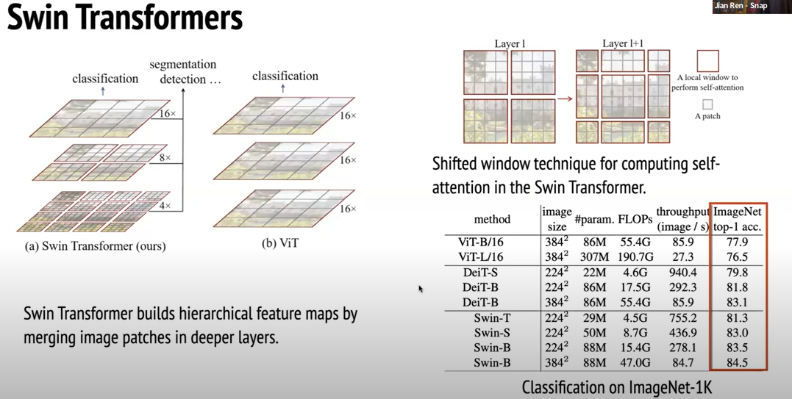

For short observations like.

Word2vec embeddings are context independent where as transformer embeddings are Context dependent. This understanding of Context gave birth to BERT, Roberta, Longformers, T5, GPT.

GPT is a Decoder-Model whose taks is only to predict next word. But no one thought that increasing the Training Data to these models helps them to understand more better & with simple finetuning they can generate task related texts with Context in mind. Excellent, isn't it..?

Deep learning is moving from Prgrammable to Configurable with Config files.

Some times it is just the architecture that matters most. like
- in LLMs, Attention  replaced with flash attention and then with paged-attention from vLLMs.
- in transformers for Vision, VIT -> DEIT-> Swin transformer and more.

The filters over the Channels is built differently from model to model. - [here](https://www.youtube.com/watch?v=wA5ZhEa8b7Q&ab_channel=ComputerVisionFoundationVideos)

From My observations with LLMs, Mistral is the Best model so far for me for the year 2023. It has performed balancing output generation for my usecases even when compared with LLama.

### Precision Types:
#### Full Precision:
- Format: Typically represented as 32-bit floating-point numbers (float32).
- Precision: High precision, providing accurate representation of decimal numbers.
- Advantage: Accurate but requires more memory and computational resources.
- Common Usage: Default format for many deep learning models.

#### Half Precision:
- Format: Represented as 16-bit floating-point numbers (float16).
- Precision: Lower precision compared to full precision, but with a smaller memory footprint.
- Advantage: Reduced memory usage and faster computation, suitable for scenarios with memory constraints.
- Common Usage: Often used in scenarios where memory and computation efficiency are critical, such as on-device or edge devices.

#### Mixed Precision:
- Combination: Involves using a combination of both full precision and half precision in a single model.
- Usage: Typically, the model's layers are partitioned, and some layers use full precision while others use half precision.
- Advantage: Balances the benefits of reduced memory usage with the need for high precision in certain parts of the model.
- Common Usage: Frequently employed in training deep learning models, especially in architectures like mixed-precision training to accelerate training time while maintaining numerical stability.

