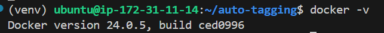
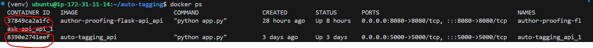

#### Docker

Docker makes Depolyment Easy and Reproducible by using **Containers**.

**Version:**


**What is Dockerfile:**
- A Dockerfile is a text document that contains all the commands a user could call on the command line to assemble an image.
- is essential blueprint/recepie for constructing docker image.
- It includes instructions such as what base image to use, what dependencies to install, what files to add, and what commands to run when the image is instantiated.
- Dockerfiles are used to automate the creation of Docker images, ensuring consistency and reproducibility.

```Dockerfile
FROM python:3.9

WORKDIR /app

COPY requirements.txt .

RUN pip install --no-cache-dir -r requirements.txt

COPY . .

CMD ["python", "app.py"]
```

#### Image Size:
**File1:** 
with 48MB. Note that this doesn't come with python and its dependencies installed. hence the less size. 
```Dockerfile
FROM alpine:3.18

WORKDIR /app

COPY . .

CMD ["python","app.py"]
```

**File2:** 
with 1.21GB. Note that this python and its dependencies installed. also pandas is installed again. hence the Medium size. 
```Dockerfile
FROM python

WORKDIR /app

COPY . .

RUN pip install pandas

CMD ["python","app.py"]
```

**File3:**
with 644MB. it has basic Ubuntu latest image, update it, install python3 and pip dependencies. Later install pandas only.

```Dockerfile
FROM ubuntu:latest

RUN apt update

RUN apt install python3 python3-pip -y

WORKDIR /app

COPY . .

RUN pip install pandas

CMD ["python","app.py"]
```

command to create **DockerImage** from the above **Dockerfile**.

- Step1: Build the Docker image.
try `docker-compose build -t imagename .` to build the image. 
you can check the recently built image using `docker image ls`. 
you can remove the image using `docker image rm -f image_name:tag`. or `docker image rm image-id`.
- `docker run -p 80:80 imagename:tag` to run the image. Doing this spins up new **container** automatically.
- `docker run -it imagename:tag bash` to run the bash shell. type `exit` to get out of the bash.
- if the process/code in `app.py` is still running, then you can see container runing live with command `docker ps`. To see all containers, use `docker ps -a`.
- remove unused image using `docker image prune -a`.

**Docker image prune vs docker image rm**
 `docker image prune -a` is used to remove dangling images (unused images with no tags), while `docker image rm` is used to remove specific images by their ID or tag, and it can remove both unused images and images in use by containers. 


#### What is a Container:
Containers allow a developer to package(this package is nothing but an Docker image.) up an application with all of the parts it needs, such as libraries and other dependencies, and ship it all out as one **package**. With that, the Application can run on Any machine. This gives universal access to run on any machine.

Running Docker image creates **Docker container**.

**How to create Docker Container:**
You need an image called **DockerImage** to create Container. Docker Image is created from **Dockerfile** which is a text file created by user. refer to `docker run` command above in **Dockerfile** commands for dockerimage creation.

you can check Container-id from below example image:


- if you want to stop the container running, then use command `docker stop containerid`.
- if you want to start the **existing** container, then use `docker start container-id`.
- `docker containers ls` only shows running containers.
- `docker containers ls -all` shows all available containers.
- if you want to stop the container running, then use command `docker stop containerid`.
- `docker container prune` to remove unused containers. `-a` flag is not required, as we used to prune image above.

#### What is Multi-Image Container:
**what is docker-compose.yml file:**
Container holds a single image or multiple image. one don't need a `docker-compose.yml` file when it is a single image. `docker-compose.yml` file is used to create Multiple Images (or) stack (or) layers of Images.

Example:
- Ubuntu base image
- Node
- mongodb
- redis

**Note:** Each container runs on diferent port.
docker-compose.yml file for single image:

```yaml
version: "3.3" # this is docker-compose version
services:
  api:
    build: .
    ports:
      - "5000:5000"
    volumes:
      - ./data:/app/data
```


- `docker-compose up` is to up the image (or) get image running live.
- `docker-compose up --build -d` Here, `-d` means `Detached` mode from terminal. So you don't see logs running in terminal. without flag `-d`, it runs the logs in terminal.

#### What is port mapping
Any application that runs using docker, creates a container. Since container is a layer on top of os, the dependencies inside a container does not match with denpendencies in local. we can say the container is a whole different environment. 

So to access the application running in that specific container on server(flask,streamlit,fastapi) with some port, we need to map it to the another local port. so we can access the specific application in local (or) in network url as well.

example in docker-compose.yml: 
```
- ports
  - "5000":"5000" #container port --> local port
```

example in Dockerfile:
```
# exposet the port to local host
EXPOSE 8000
```


#### what is host mapping
Every server (or) even container runs on host address `0.0.0.0`. so to access this address in local, we need to use `127.0.0.1` along with exposed port `8000`.


**References:**
[piyush garg docker tutorial 1](https://www.youtube.com/watch?v=31k6AtW-b3Y)
[piyush garg docker tutorial 2](https://www.youtube.com/watch?v=xPT8mXa-sJg)
[Techworld with nana docker tutorial](https://www.youtube.com/watch?v=3c-iBn73dDE)
[patrick tutorial on devcontainers](https://www.youtube.com/watch?v=0H2miBK_gAk)


