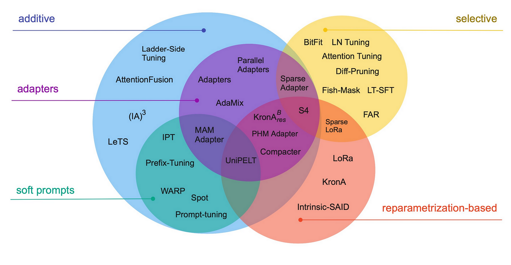
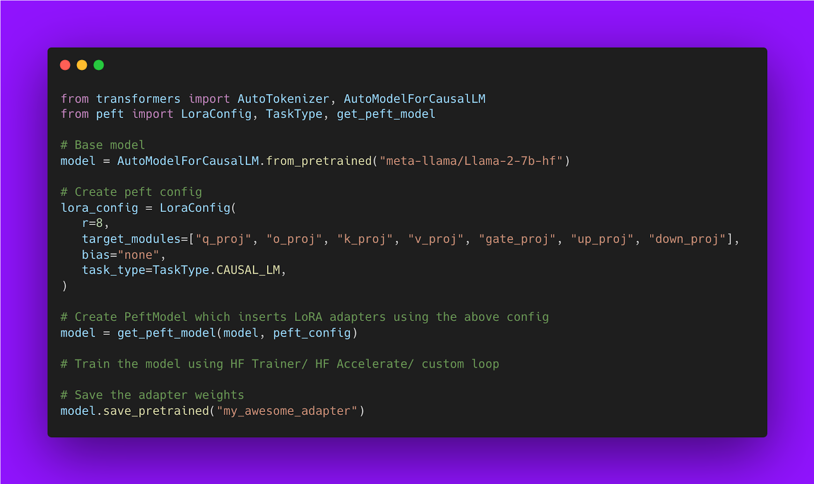
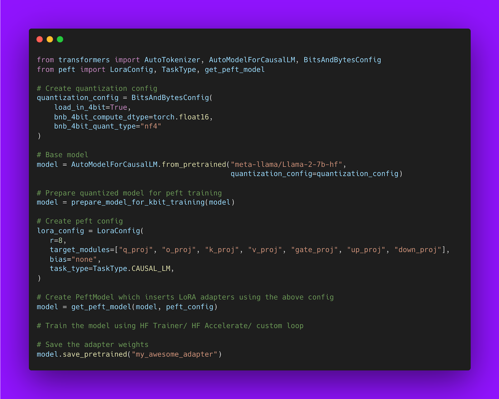

Why finetuning is expensive?

### Memory Calculation:
in case of LLama model, we need to allocate per parameter:

- 2 bytes for the weight
- 2 bytes for the gradient
- 4 + 8 bytes for the Adam optimizer states

With a total of 16 bytes per trainable parameter, this makes a total of 112GB(excluding the intermediate hidden states), given that the largest GPU today has only 80GB it makes finetuning hard.

#### PEFT is the Saviour

Parameter Efficient Fine Tuning can drastically reduce the number of trainable parameters in a model. There are lot of Exisiting PEFT Methods. We will see **LORA** as the most widely adopted PEFT in the Community.



#### LORA
- LoRA *decomposes a large weight matrix into two smaller*, low-rank matrices (called update matrices). 
- These new matrices can be trained to adapt to the new data while keeping the overall number of changes low. 
- The original weight matrix remains frozen and doesn’t receive any further adjustments.

##### Advantages:
- LoRA makes fine-tuning more efficient by drastically reducing the number of trainable parameters.
- The original pre-trained weights are kept frozen, **which means you can have multiple lightweight and portable LoRA models for various downstream tasks** built on top of them.
- LoRA is orthogonal to many other parameter-efficient methods and can be combined with many of them.
- The performance of models fine-tuned using LoRA is comparable to the performance of fully fine-tuned models.-- **interesting**.
- LoRA does not add any inference latency when adapter weights are merged with the base model.

#### NOTE:
in Transformer models LoRA is typically applied to attention blocks only.

Code snippet:


#### QLORA:
QLORA = Quantized Model weights + Low Rank Adapters. 

 Due to the significantly reduced size of the quantized model it becomes possible to generously place low-rank adaptors at every network layer, which together still make up just 0.2% of the original model’s weight memory footprint. 

In addition to generous use of LoRA, to achieve high-fidelity fine-tuning of 4-bit models, QLoRA uses 3 further algorithmic tricks:

- **4-bit NormalFloat (NF4) quantization**, a custom data type exploiting the property of the normal distribution of model weights and distributing an equal number of weights (per block) to each quantization bin—thereby enhancing information density.
- **Double Quantization**, quantization of the quantization constants (further savings).
- **Paged Optimizers**, preventing memory spikes during gradient checkpointing from causing out-of-memory errors.

#### NOTE:
An interesting aspect is the **dequantization** of 4-bit weights in the GPU cache, with matrix multiplication performed as a 16-bit floating point operation. 

In other words, we use a low-precision storage data type (in our case 4-bit, but in principle interchangeable) and one normal precision computation data type. 

This is important because the latter defaults to 32-bit for hardware compatibility and numerical stability reasons, but should be set to the optimal BFloat16 for newer hardware supporting it to achieve the best performance.

#### Using QLoRA in Practice:
```python
import torch
from transformers import AutoModelForCausalLM, AutoTokenizer

model_id = "facebook/opt-125m"
# For LLM.int8()
# model = AutoModelForCausalLM.from_pretrained(model_id, load_in_8bit=True)

# For QLoRA
model = AutoModelForCausalLM.from_pretrained(model_id, load_in_4bit=True)
```

### Memory Calculation After QLoRA:
with QLORA, we need to allocate per parameter:

- ~0.5 bytes for the weight
- 2 bytes for the gradient
- 4 + 8 bytes for the Adam optimizer states

Giving a total of 14 bytes per trainable parameter times 0.0029 as we end up having only 0.29% trainable parameters with QLoRA, this makes the QLoRA training setup cost around 4.5GB to fit, but requires in practice ~7-10GB to **include intermediate hidden states which are always in half-precision** (7 GB for a sequence length of 512 and 10GB for a sequence length of 1024).

How to train QLoRA using HuggingFace PEFT:


#### References:
- Colab: [here](https://colab.research.google.com/drive/1vIjBtePIZwUaHWfjfNHzBjwuXOyU_ugD?usp=sharing)
- Blog: [here](https://pytorch.org/blog/finetune-llms/)

