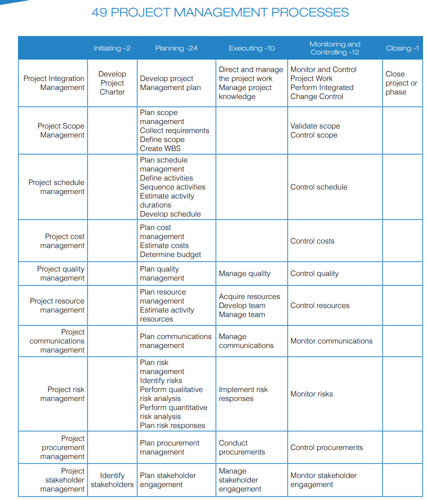
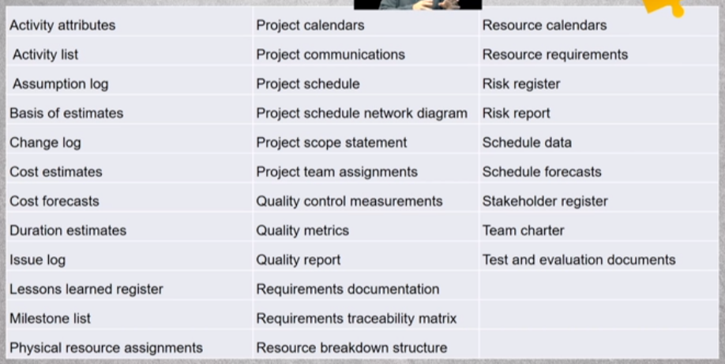

This page has Notes from the Project Management Professional Course.

- PM- stands for Project Management
- PMO- Project Management office
- OPM- Organization project management
- KPI- Key performance Indicators
- Phasegate- untill a phase is fully completed, I can not move to the next phase in project.

#### Business value:
what are the project success criteria/checklist.
projects end when:

- Objectives meet
- Objectives can not or will not be met
- Funds are depleted
- Need no longer exist
- Resources are no longer available.

#### Projects create business value:
- Tangible business value:
	- Monetary assets
	- stockholder equity
	- market share
- Intangible business value:
	- Goodwill & reputation
	- Brand recognition
	- benefit to public
	- strategic alignment

#### Projects initiation Context:
- stakeholder requested for project
- technological advancement created need for new project
- crating new products, improving exisiting produts, and more

#### Typical Project managements:
- identifying requirements
- addressing needs, concern, rquirements of stakeholders.
- settingup, maintaining, and carrying communication.
- balancing competing project constraints.

	- Scope
	- quality
	- budget
	- resources
	- risks

#### PM LifeCycle:
- Idea or Concept
	- Formulate the Idea
		- Business case
			- feasibility study
				- project

#### Project Management application areas:
- Construction
- Healthcare
- finance
- IT
- Govt
- NGOs

#### Other areas that effect project Management:
- program management
- portfolio management
	- A senior level excutive managing where & how do we invest in programs and different projects.
	- portfolios are about maximizing investments.
	- portfolio is collection of programs, program is collection of projects.

#### PMO- Project management office:
- supports project managers
- manages shared resources
- coaching, mentoring & training for project managers
- conducts project audits(to ensure whether using right tools)
- develops & maintains procedures.
- facilitates communication across different projects to speedup

#### Organizational Culture and Structure:
- Vision
- Mission
- Values and Beliefs
- Cultural Norms
- Hirarchy and authority
- organizational & managment style

Project Management Process:

#### Work Performance Data:
- Raw data & facts about project.
- status of project work assignments
	- percent complete
	- in progress
	- start & finish dates
- Data can include:
	- Cost of the activities.
	- no.of.change requests.
	- Defects
	- Duration

#### Work Performance Information:
- Analyzed work performance data.
- usable information to make decisions.
- status of actionable results.

#### Work Performance Reports:
- Work performance information in communicable form.
- Status reports
- Memos
- Dashboards
- Project updates
- helps stackholders make decision

#### Project Management Lifecycles:

- Predictive lifecycle
	- plan-driven
	- waterfall approach
	- predicts the project life cycle
	- changes to scope are tightly contolled
- Iterative (or) Incremental lifecycle
	- iterations create deliverables(we deliver in each iteration)
	- detailed scope is elaborated for each iteration.
	- changes to the project scope are expected.
- Adaptive Life cycle
	- change driven
	- agile project managment
	- rapid iterations (or) project work (or) sprint based (15 days mostly)
	- backlog of requirements
	- changes to the project scope are expected

Business Document for Project Management(to present to management):

- report phase-gate work
- report actual performance/costs compared to earlier business documents.
	- if I did great, then cool
	- if not, then create variance/exception report to report why I did not hit my KPI, why I was late or why I was over budget.
- Decision of comparision include:
	- should we continue to next phase(if overcost, if too much delay,)
	- end of the project
	- should remain in the same phase
	- repeat the phase again

#### Project Business case:
- economic feasibility study- is it financially profitable..?
- benefits the project creates
- project sponsor is accountable for the developement & maintainence not the manager.
- PM responsible for  providing recommendations.

#### Business Needs:
- what is prompting the need for action
- statement document the opportunity
- stakeholders effected
- identification of the scope

#### Business case: project determination:
- root cause of an opportunity
- gap analysis of capabilities
- know risks
- critical success factors
- Decision criteria

#### Organizational knowledge repositories:
- cataloging
- archieveing
- retrievable
- Organization process Assets(the then worked team on the usecase) are part of knowlege repositories.
- archieve at closure.
- storage
	- project files from past projects
	- historical information and lessons learned
	- issues and defect databases
	- configuration management databases
	- financial databases

## Role of Project Manager:
- Manage things, lead people to conclusion
- getting things done
- active listener & speaker
- written & oral to internal(team) & to external(to non team and to management)
- project manage negotaites:
	- aim for fair agreement
	- priorities
	- technical approach
	- project scope
	- schedule
	- cost
	- changes to project scope, schedule , budget
	- vendor teams and conditions
	- resource constraints.
- PMs solve problems
	- problem definition
	- RCA- root cause analysis
	- treat causes, not symptoms
	- Don't go to the management without a solution

Values to have to be a PM:

- knowledge: understanding project management
- performance: accomplish as a project manager
- personal: behavior, effectiveness, character, leadership

### Project Documents:

