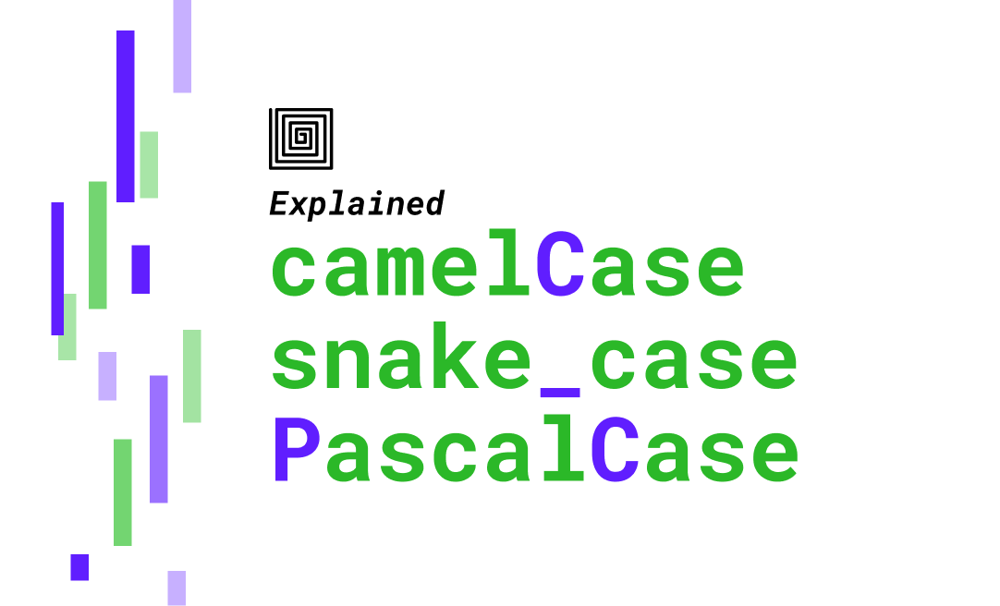

1.Varibale Casing

Casing in python:
- Pascal casing is not used in python much.
- Snke casing is used mostly.


2.**id()**: unique identifier is memory address of object referenced by a variable. 
```python
a = 10000
id1 = id(a)
b = a + 2-2
id2 = id(b)

print(id1)
print(id2)
```

2.1. `ord` and `chr`:
```python
unicode_code_point = ord("h")
print(unicode_code_point)
# 104

human_readable_character = chr(104)
print(human_readable_character)
# h
```

3.0. `and` VS `or`:
```python
# inclusive
if 5>0 and 5<10: # when the number is b/n 2 bounds
    print("Yes Condition true")
```
or 
```python
# Exlusive
s = 10
if 10 < 15 or 10> 0: # when the number is outside 2 bounds
    print("yes it is true")
```
3.iterating a pair
```python
numbers = range(100)

#using zip(numbers, numbers[1:]), iteration wont go out of index
# zip equals the 2 lists to the list with low length.
for i,j in zip(numbers, numbers[1:]): 
    print(i,j)
```
3.copy with out impacting original
```python
numbers = list(range(100))
print(numbers)


numbers1 = list(numbers)# this creates a copy of original
numbers1[0] = 10000
print(numbers1)
```

4.If any problem is related to *Arrays* & it involves o(n^2) time complexity, then doing a computation that takes O(log n) wont make much difference. So Overall time complxity will again be O(n^2) only.


5.Anonymous Variable.

```Python
for _ in range(100): # here instead of "i", "_" is used. so we are limiting memory & usage.
    print("This is Bytes of Python")

a,b,_ = "value1", "value2", "value3" # since we dont need "value3" to use, so using anonymous variable.
```

6.Function readability

Instead of keeping multiple logics in Single function, it is always better to keep multiple simple functions for multiple logics. this way it is easier to route through, to understand, to read the code more clearly.

7.Type hinting

Type hinting in python enhances code readability. helps anyone to easily understand the type of data that goes inside and comes outside of a function.

<p align="center" width="100%">
    </img>
</p>


8.Exception-handling

Exception handling is must and always handy.

9.Parquet
using parquet(instead of csv/json/numpy/pickle) file comes with less storage size & quick redability
