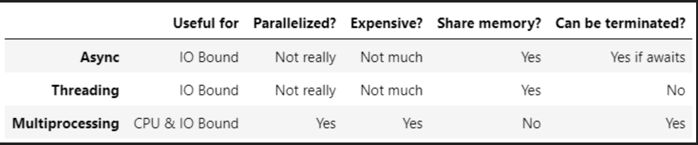
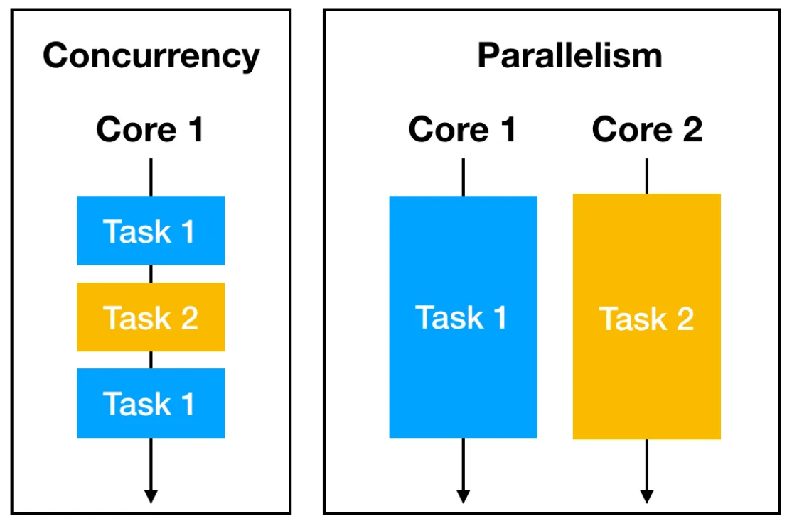
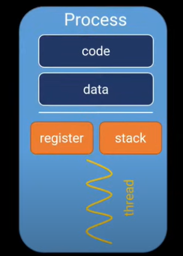
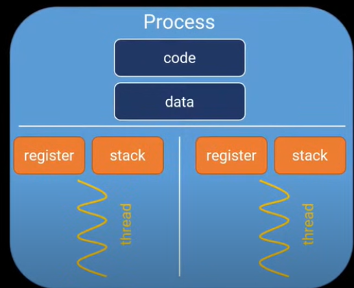
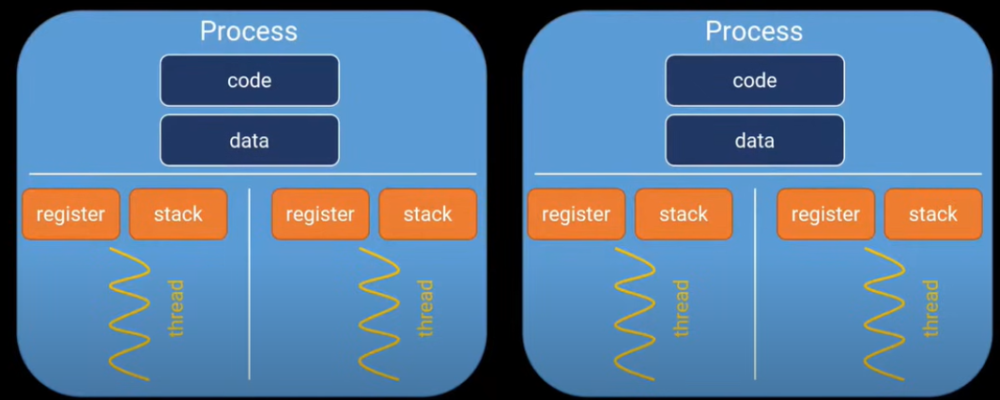
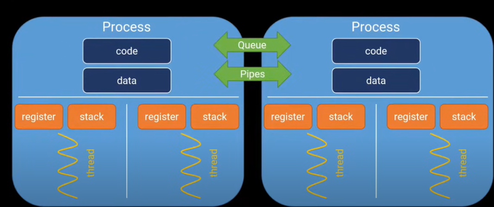
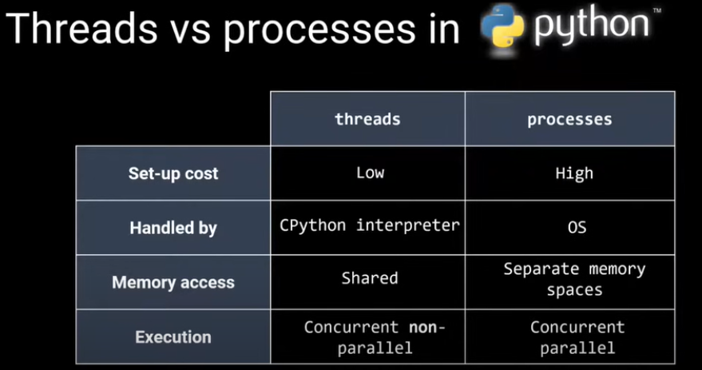
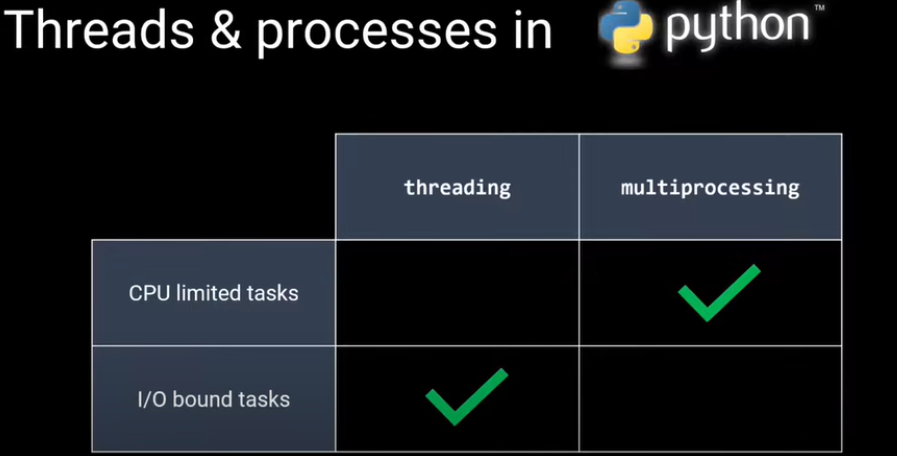

**1. Is python multithread:**

Python is multithreaded, but not paralelly multithreaded. It means both threads can not start at same time.

#### What is concurrency?
Before understanding multithreading and multiprocessing, one should know about concurrency. **Concurrency is Execution of Multiple tasks simultaneously.**

- Multithreading

- Multiprocessing

- Asyncio

All the 3 has their own advantages and disadvantages.


#### Concurrency vs Parallelsim:
Running multiple tasks simultaneously is **Concurrency**. Multi-Threading is example of concurrency, as we run different parts of program using multiple threads simultaneously. 

Multiprocessing is example of parallelism. Multiprocessing uses multiple cores, with each core having a thread.



**2.what is a Process:**

A process is an instance of a programme. This may be an instance of firefox, notepad, vscode. Each process will **atleast have one thread**, which again has own **register, and stack**.



Os can determine, when and  how long a thread can run. A process can spawn a single thread or multiple threads.



Data is accessible between threads.

But Not between Process.



In order to share data between 2 processes, we need **Queue** and **Pipes**.



##### 3.GIL

In order for threads to run (or) for threads safety(means no Deadlocks), One need GIL.


##### 4.Thread vs Process

A core in CPU atleast uses a Single thread. using multiple threads for single core of a CPU is called Multithreading. 

Using multiple cores of a CPU, with each core having atleast a single thread is called multiprocessing.



Concurrent **non** parallel in the above image, says that **threads** can not start at same time, means parallely.

Threads have memory shared between. where as in process a seperate memory for each process is used & they can be accessed with queues and pipes.(Discussed above).

#### Threading vs Processing in Real Time.


from above pictures, we see in threading, no 2 threads start at same time. also threding occurs in single core. 

where as in processing, 2 process can start at same time. each process uses a single core.

#### Note: 
Since both threads can not start at same time, a process can stay idle for some time overall(look above image). It means we are not utilizing it effiently.

Where as Process can run simultaneously, we are utilizing CPU efficiently.

#### When to use threading & when to use Processing.



- threading is suggested for I/O dependent tasks.
- processing is suggested for Compute heavy tasks.

#### Threading vs Multiprocessing:
you'll observe that 

**threading** is generally faster to start but shares the same memory space (Global Interpreter Lock or GIL) which can lead to performance degradation for CPU-bound tasks.

**Multiprocessing**, on the other hand, creates separate memory space for each process, which avoids GIL-related issues but incurs more overhead due to the creation of separate processes.

Multithreadig Example1:
```Python
import threading
import time

def print_numbers():
    for i in range(5):
        print("Thread 1:", i)
        time.sleep(1)

def print_letters():
    for char in 'abcde':
        print("Thread 2:", char)
        time.sleep(1)

thread1 = threading.Thread(target=print_numbers)
thread2 = threading.Thread(target=print_letters)

thread1.start()
thread2.start()

thread1.join()
thread2.join()

print("Multithreading finished.")

```

#### What is Start and Join

We start both the threads using **start()** method. 

**join()** ensures that the main thread waits for these threads to complete before terminating.

Multithread example2:
```
import threading

def compute_prime(limit):
    primes = []
    for num in range(2, limit + 1):
        if all(num % i != 0 for i in range(2, int(num ** 0.5) + 1)):
            primes.append(num)
    print("Thread 1 - Prime numbers:", primes)

def compute_factorial(num):
    factorial = 1
    for i in range(1, num + 1):
        factorial *= i
    print("Thread 2 - Factorial:", factorial)

thread1 = threading.Thread(target=compute_prime, args=(50,))
thread2 = threading.Thread(target=compute_factorial, args=(5,))

thread1.start()
thread2.start()

thread1.join()
thread2.join()

print("Multithreading finished.")
```

- The key advantage of multithreading is that it allows maximum utilization of a single CPU core by executing threads concurrently.

- All threads share same process resources like memory. 

- Context switching between threads is lightweight.

Multiprocessing Example1:
```Python
from multiprocessing import Process
import time

def print_numbers():
    for i in range(5):
        print("Process 1:", i)
        time.sleep(1)

def print_letters():
    for char in 'abcde':
        print("Process 2:", char)
        time.sleep(1)

if __name__ == '__main__':
    process1 = Process(target=print_numbers)
    process2 = Process(target=print_letters)

    process1.start()
    process2.start()

    process1.join()
    process2.join()

    print("Multiprocessing finished.")

```

Multiprocessing Example2:
```Python
from multiprocessing import Process

def compute_prime(limit):
    primes = []
    for num in range(2, limit + 1):
        if all(num % i != 0 for i in range(2, int(num ** 0.5) + 1)):
            primes.append(num)
    print("Process 1 - Prime numbers:", primes)

def compute_factorial(num):
    factorial = 1
    for i in range(1, num + 1):
        factorial *= i
    print("Process 2 - Factorial:", factorial)

if __name__ == '__main__':
    process1 = Process(target=compute_prime, args=(50,))
    process2 = Process(target=compute_factorial, args=(5,))

    process1.start()
    process2.start()

    process1.join()
    process2.join()

    print("Multiprocessing finished.")

```


Finally note that for multi-procesing, using all cores is very extreme. it is suggested to use only half of avaible cores in CPU. 

- Multiprocessing is memory overhead.

- Multithreading is Context-switch b/n threads & synchronization.